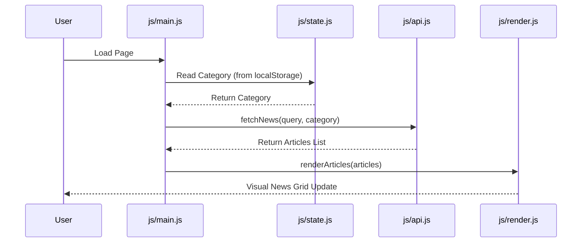

# Live News Feed Application

A fast, modular, and responsive client-side web application that fetches and displays real-time news articles using the [NewsAPI](https://newsapi.org/). Built with standard HTML5, CSS3, and ES6 modules, the project demonstrates clean separation of concerns, debounced search filtering, state persistence, and DOM performance optimization.

---

## 📂 Project Structure

```text
news-feed/
├── index.html          # Main HTML structure and entry point
├── css/
│   └── style.css       # Core design system, layout, and responsive styles
└── js/
    ├── main.js         # Application bootstrapper and event handlers
    ├── state.js        # Centralized client-side state management
    ├── api.js          # API service for fetching news and error handling
    ├── render.js       # DOM rendering functions and loading/error states
    └── utils.js        # Helper functions (debounce, date formatter)
```

---

## ⚙️ Module Analysis

### 1. `index.html`
* **Purpose:** Defines the structural layout of the application.
* **Key Features:**
  * Imports the main CSS stylesheet in the `<head>` to prevent flash of unstyled content (FOUC).
  * Uses semantic HTML5 elements like `<header>`, `<main>`, `<section>`, and `<footer>` for better accessibility (a11y) and SEO.
  * Contains simple and accessible input elements (search and category filter) with `aria-label` attributes.
  * Loads the Javascript entry point as an ES6 module (`type="module"`) to enable clean import/export syntax natively.

### 2. `css/style.css`
* **Purpose:** Handles the visual layout, typography, themes, and responsiveness.
* **Key Features:**
  * **Design System Variables:** Uses CSS Custom Properties (`--primary-color`, `--bg-color`, `--shadow-md`, etc.) for consistency and easy theme updates.
  * **Responsive Grid:** Employs CSS Grid for the news feed layout, starting at a single column for mobile views and scaling up to 4 columns on large screens via media queries.
  * **Sticky Header:** Keeps search and filtering controls accessible at the top of the viewport during scrolling.
  * **Visual Polish:** Implements smooth transitions (`transition: all 0.3s ease`) and depth through box-shadows on cards to create a premium feel.

### 3. `js/main.js`
* **Purpose:** Serves as the orchestrator that hooks up event listeners and coordinates actions.
* **Key Features:**
  * Initializes the application once the DOM is fully loaded (`DOMContentLoaded`).
  * Binds events to the search input using a **debounced** listener (500ms delay) to prevent redundant API queries.
  * Binds events to the category selection dropdown, clearing active search queries when category changes to keep the UX predictable.
  * Triggers the initial fetch and render cycles.

### 4. `js/state.js`
* **Purpose:** Provides a centralized, single source of truth for the application's state.
* **Key Features:**
  * Manages state variables: `query`, `category`, `articles`, `isLoading`, and `error`.
  * Preserves user preferences by caching and reading the selected news category from `localStorage`.
  * Exposes an `updateState` helper function to change state values safely.

### 5. `js/api.js`
* **Purpose:** Handles HTTP communication with the NewsAPI.
* **Key Features:**
  * **Dynamic Endpoints:** Automatically switches between NewsAPI endpoints:
    * `/everything` for text-based queries (which returns all matching articles).
    * `/top-headlines` for category-based filtering (which returns current top stories).
  * **Error Handling:** Gracefully handles common network issues, CORS restrictions on free tiers, expired or missing API keys (401), and rate-limiting (429).
  * **Data Filtering:** Automatically filters out invalid or empty articles (e.g., articles with title `[Removed]` or missing links).

### 6. `js/render.js`
* **Purpose:** Renders dynamic content onto the DOM.
* **Key Features:**
  * **Performance Optimization:** Uses `DocumentFragment` to construct all news cards in memory before appending them to the DOM in a single operation. This avoids multiple expensive browser reflows/repaints.
  * **Asset Fallbacks:** Uses robust placeholder images and `onerror` event handlers on `` tags if article images fail to load.
  * **State UI:** Manages interactive visual components for loading spinners, info alerts, and error banners.

### 7. `js/utils.js`
* **Purpose:** Provides utility helpers to avoid code repetition.
* **Key Features:**
  * **`debounce(func, delay)`**: High-order function that delays executing the search request until the user stops typing for 500ms.
  * **`formatDate(dateString)`**: Standardizes ISO timestamps into localized, human-readable date formats (e.g., "Oct 12, 2023").

---

## 🔄 Data & Execution Flow



1. **Initialization:** The app reads the last selected category from `localStorage` (defaulting to `general`), populates the filter dropdown, and retrieves the initial news batch.
2. **Search Input:** The user types a query. The debounced handler waits 500ms after the last keypress and initiates a fetch using `/everything`.
3. **Category Selection:** The user changes the category. The app clears any active search query, saves the new category selection in `localStorage`, and triggers a fetch using `/top-headlines`.
4. **Fetching & UI Updating:** A loading spinner is shown. When data is received, the articles are filtered and inserted using a `DocumentFragment`. If an error occurs, a styled alert is rendered instead.

---

## 🚀 Deployment

### GitHub Pages (Automatic)

The repo includes a GitHub Actions workflow (`.github/workflows/deploy.yml`) that auto-deploys the `main` branch to GitHub Pages.

**Setup:**
1. Push this repo to GitHub
2. Go to **Settings > Pages** in your repo
3. Under "Source", select **GitHub Actions** (not "Deploy from a branch")
4. The Action runs automatically on every push to `main`

### CORS Note

NewsAPI's free tier blocks browser requests from production domains. This project detects non-localhost environments and routes API calls through a public CORS proxy (`corsproxy.io`) to bypass this restriction. For production use, swap the API key proxy for a serverless function or upgrade your NewsAPI plan.

## 🚀 Future Recommendations & Enhancements

1. **Secure API Key Storage:** Moving the API key from frontend code to a backend serverless function (e.g., Netlify Functions, Cloudflare Workers, or Firebase Functions) to prevent API key exposure and abuse.
2. **Strict HTML Sanitization:** Adding an HTML sanitizer (like DOMPurify) before inserting dynamic content to prevent Cross-Site Scripting (XSS) risks from untrusted external feed content.
3. **Pagination & Infinite Scroll:** NewsAPI returns paginated results. Adding a "Load More" button or an IntersectionObserver-based infinite scroll would improve content discovery.
4. **Theme Switcher:** Implementing a Dark/Light toggle utilizing the existing CSS custom properties for enhanced user visual accessibility.
